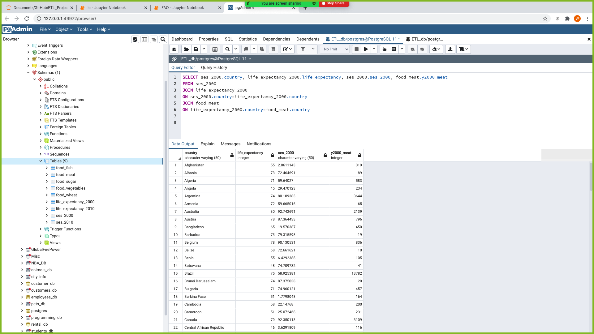

# ETL_Project
Contributors  
  Thomas Babjak   
  Fleming Brathwaite   
  Will Cutrone   
  Edyson Katuuo   
  
Datasets:

“Who eats the food we grow?”   
https://www.kaggle.com/dorbicycle/world-foodfeed-production   
Date range: 1961-2013   
In-scope: >245 countries and territories

“Life Expectancy (WHO)”   
https://www.kaggle.com/kumarajarshi/life-expectancy-who   
Date range: 2000-2015   
In-scope: 193 countries

“Country Socioeconomic Status Scores: 1880-2010”   
https://www.kaggle.com/sdorius/globses   
Date range: 1880-2010 (in decades)   
In-scope: 149 countries 

Objective:
The objective of this project was to take the three datasets above and perform the extract, transform and load process so that more complex queries could be done to observe trends between the three datasets. The end goal was to get all three datasets into different tables in one SQL database. The first step was to load each of the three csv's into jupyter notebook (extraction). After the csv's were uploaded into jupyter notebooks, we made them into pandas dataframes. The next step was to clean each of these dataframes so that eventually we could just view the relevant columns in each dataframe. We also wanted to arrange the dataframes in a manner where each row would have a unique country, in order to eventually join all tables in SQL on the "country column". After modifying the dataframes to appear the way we wanted, we then used engine to make a connection to pgadmin and take the data from our dataframe and insert it into the various sql tables. After this, a table join was performed in pgadmin and we were able to create a table that showed data on food availability, life expectancy, and socioeconomic status by country. An example of the tables being joined can be seen below.

